# Lighthouse mid_project
## QUIZ APP

### Collaborators
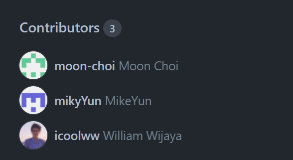

#### Final Product
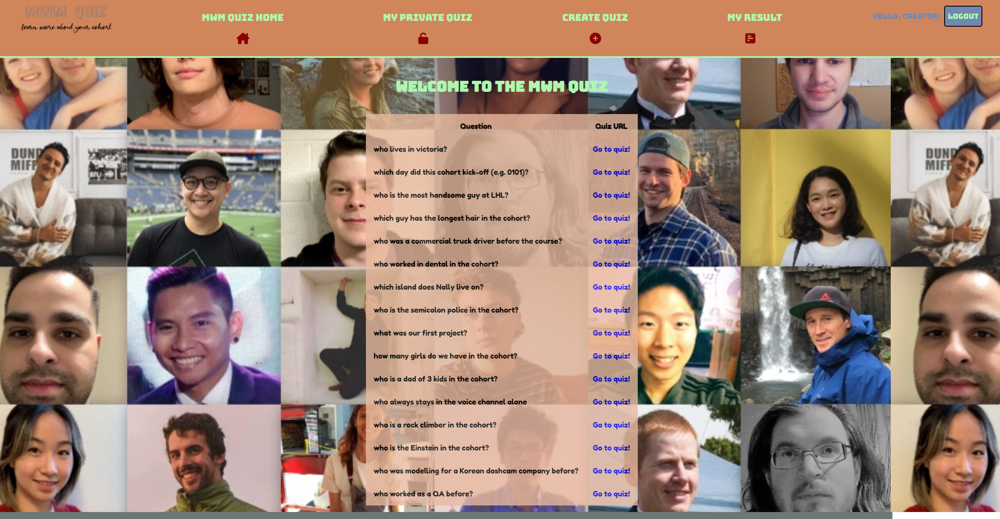
#### Main Page

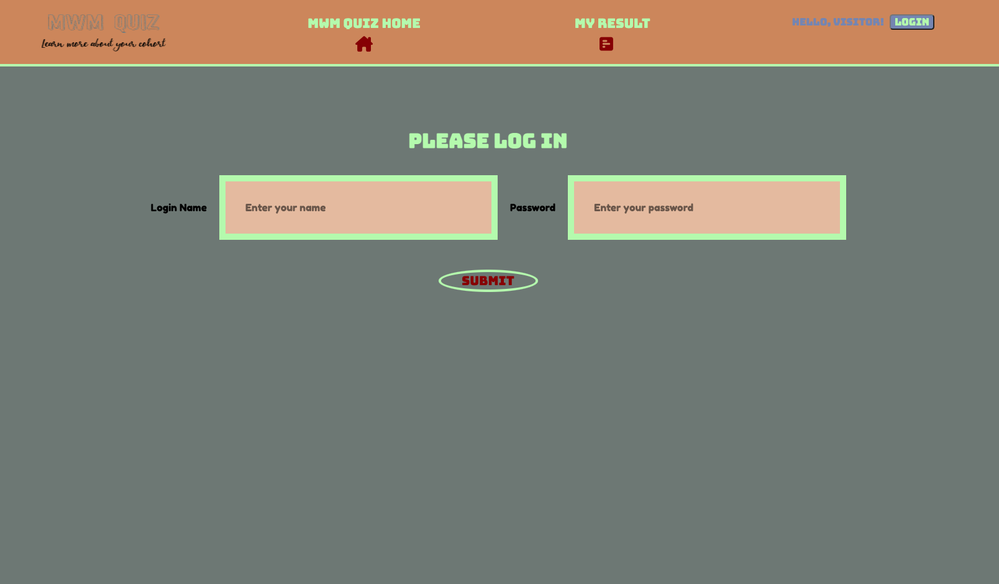
#### Login Page

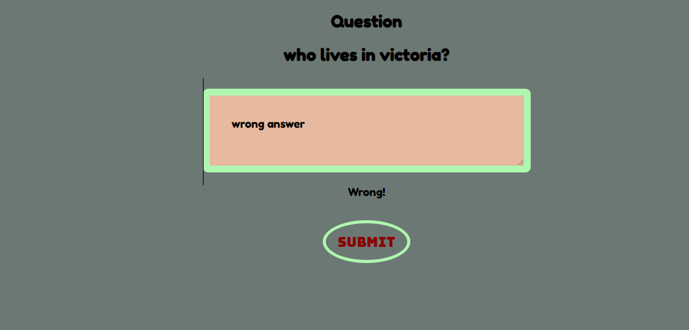
#### Incorrect Answer Message

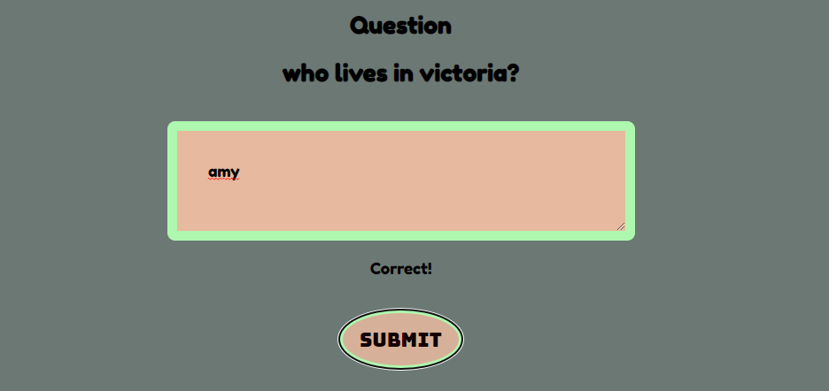
#### Correct Answer Message

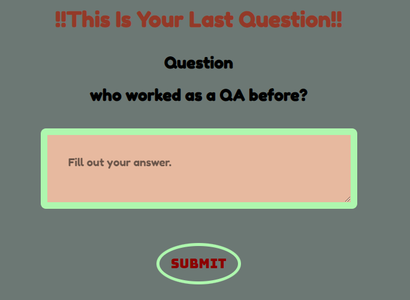
#### Last Public Question Message

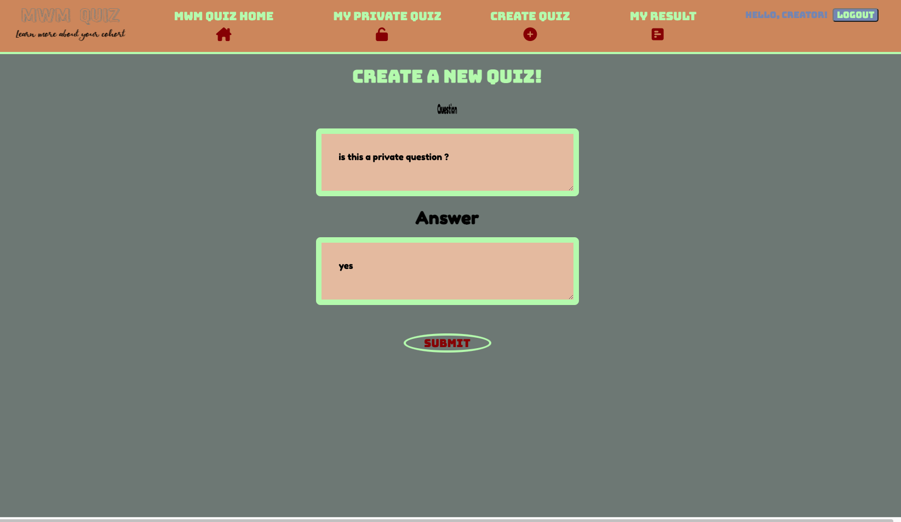
#### Create Private Quiz

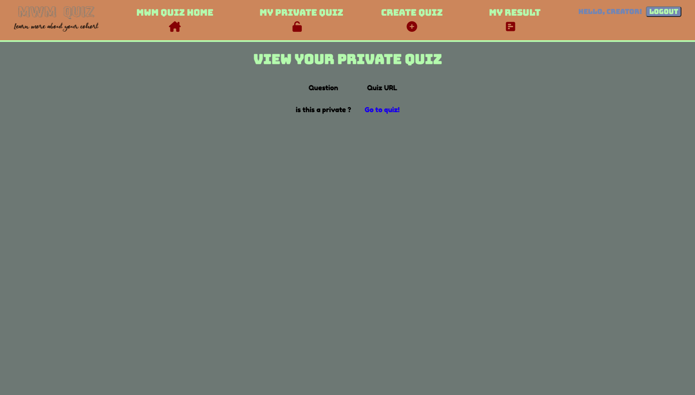
#### Private Quiz List Page

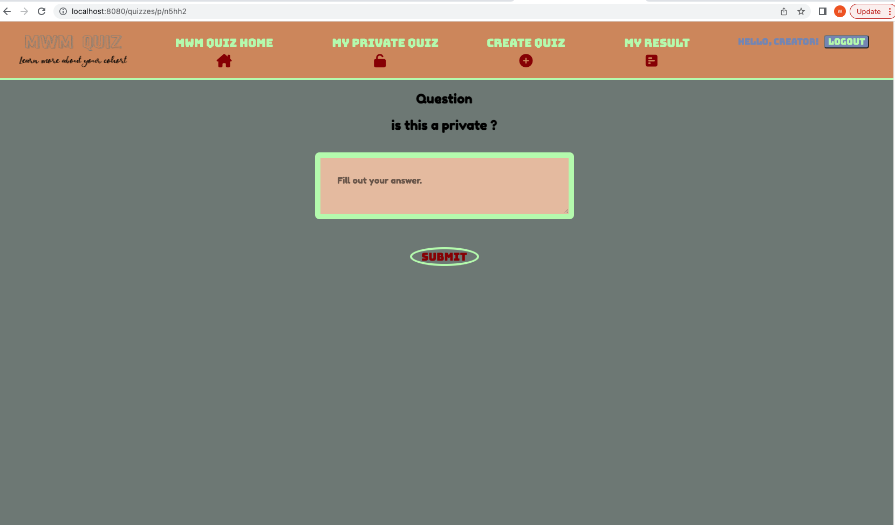
#### Private Question Page

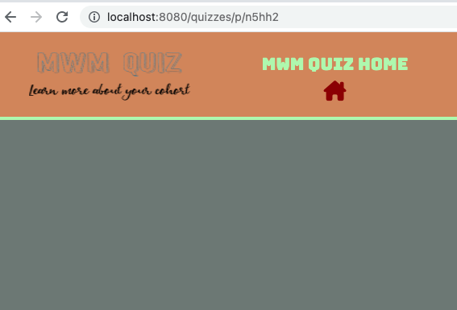
#### Private Question URL

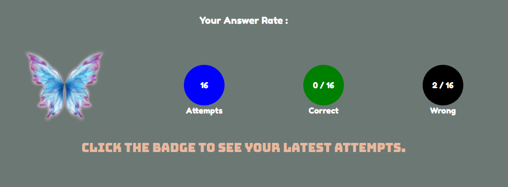
#### Result with Badge

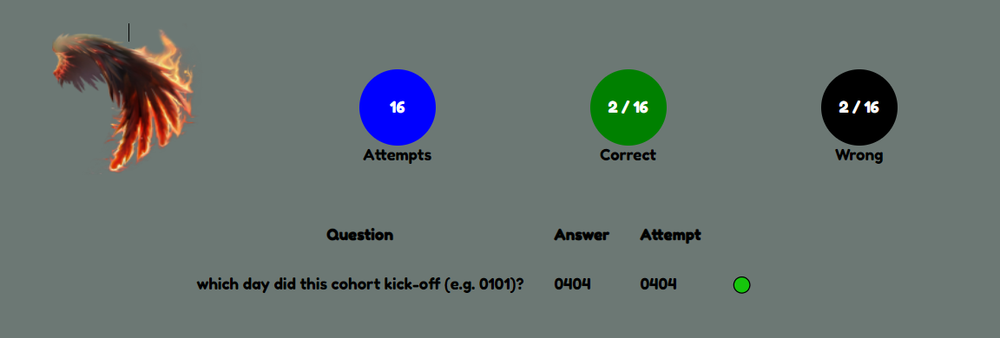
#### Latest Attempt By Clicking The Badge

=========

## DEPENDENCIES
- chalk
- cookie-session
- dotenv
- ejs
- express
- morgan
- node-sass
- pg
- sass

## DEV DEPENDENCY
- nodemon

## GETTING STARTED
- Install all dependencies (using the 'npm install' command)
- Run 'npm run db:reset' to create all default database
- Run the development web server using the 'npm run local' command
- Go to <http://localhost:8080/quizzes> in your browser

## VISITORS
- As a visitor, I can visit an unlisted quiz URL
- As a visitor, I can visit an unlisted quiz URL and take the quiz.
- As a non-user, I shouldn't be able to see the results of others' attempts.
- As a non-user, I shoudln't be able to share a link to the result of others' attempts.

## USERS
- Users can create quizzes 
- Users can make their quiz unlisted
- Users can see a list of public quizzes
- Users can see a list of public quizzes on the home page
- Users can attempt a quiz
- Users can see the results of their latest attempt

## FEATURES
- In results page, the badge will be reflected based on user's correct rate
- Click badge to show the latest attempt
- In public question page, if user's answer is correct, go to the next question
- If it is the last public question, show the message to user

## Project Setup

The following steps are only for _one_ of the group members to perform.

1. Create your own copy of this repo using the `Use This Template` button, ideally using the name of your project. The repo should be marked Public
2. Verify that the skeleton code now shows up in your repo on GitHub, you should be automatically redirected
3. Clone your copy of the repo to your dev machine
4. Add your team members as collaborators to the project so that they can push to this repo
5. Let your team members know the repo URL so that they use the same repo (they should _not_ create a copy/fork of this repo since that will add additional workflow complexity to the project)